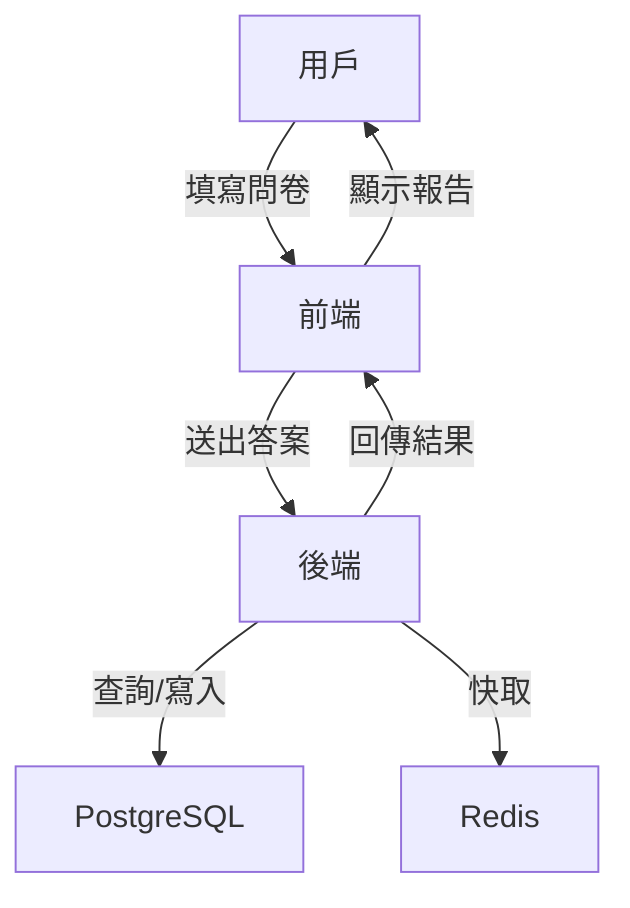

# 系統架構設計文檔 (System Architecture Document) - 綜合人格特質分析平台

---

**文件版本 (Document Version):** `v0.1`

**最後更新 (Last Updated):** `2024-07-16`

**主要作者/架構師 (Lead Author/Architect):** `[請填寫]`

**審核者 (Reviewers):** `[請填寫]`

**狀態 (Status):** `草稿 (Draft)`

**相關 PRD/專案簡報:** `[docs/00_project_brief_prd_summary.md]`

**相關 ADRs:** `N/A（初期未分離ADR）`

---

## 目錄 (Table of Contents)
1. 引言 (Introduction)
2. 架構概述與目標 (Architecture Overview and Goals)
3. 需求回顧 (Requirements Revisited)
4. 高層次架構設計 (High-Level Architectural Design)
5. 技術選型詳述 (Technology Stack Details)
6. 可行性分析概要 (Feasibility Analysis Summary)
7. Production Readiness Checklist (PRC) - 初步考量
8. 未來展望與演進方向 (Future Considerations and Evolution)
9. 附錄 (Appendices)

---

## 1. 引言 (Introduction)
### 1.1 目的與範圍 (Purpose and Scope)
* 目的：為「綜合人格特質分析平台」提供清晰一致的高層次架構藍圖，指導後續詳細設計與開發。
* 範圍：涵蓋前端、後端、資料庫、部署與本地開發環境（Poetry），不含外部API串接。

### 1.2 目標讀者 (Target Audience)
* 架構師、開發團隊、產品經理、測試與運維人員。

### 1.3 術語表 (Glossary)
| 術語/縮寫 | 完整名稱/解釋 |
| :--- | :--- |
| MBTI | Myers-Briggs Type Indicator |
| DISC | Dominance, Influence, Steadiness, Conscientiousness |
| 五大人格 | Big Five Personality Traits |
| 九型人格 | Enneagram |
| Poetry | Python 依賴與虛擬環境管理工具 |

### 1.4 參考文件 (References)
* [PRD/專案簡報: docs/00_project_brief_prd_summary.md]

---

## 2. 架構概述與目標 (Architecture Overview and Goals)
### 2.1 系統願景與核心價值
* 打造一站式、中文化的人格特質分析平台，整合多種主流理論，協助個人與團隊深入自我探索並獲得實用建議。

### 2.2 架構目標與原則
* 架構目標：
  - 高可用性、可維護性、可擴展性
  - 支援多種人格理論整合分析
  - 前後端分離，易於後續擴充
  - 本地開發友善，易於部署
* 設計原則：
  - 單一職責、鬆耦合、模組化
  - API 優先、資料庫驅動
  - 僅支援中文介面

### 2.3 主要制約因素與假設
* 制約：
  - 僅本地部署，無需雲端資源
  - 不需外部API/KEY，分析邏輯與結果寫死於資料庫
  - 初期不考慮高併發
* 假設：
  - 使用者數量初期有限
  - 開發團隊熟悉 Python、React、PostgreSQL

---

## 3. 需求回顧 (Requirements Revisited)
### 3.1 功能性需求摘要
* 多種人格測驗（MBTI、DISC、五大、九型）
* 綜合分析報告（資料庫查詢/組合）
* 個人化建議（資料庫靜態內容）
* 圖表視覺化、互動模擬、成長追蹤
* 團隊/個人管理、歷史查詢

### 3.2 非功能性需求
| NFR 分類 | 具體需求描述 | 衡量指標/目標值 |
| :--- | :--- | :--- |
| 性能 | 單用戶互動流暢 | API 響應 < 300ms |
| 可用性 | 本地單機可用 | 99% |
| 安全性 | 僅本地資料，無外部API | 僅本地存取 |
| 可維護性 | 模組化、易於擴充 | 新功能開發 < 3天 |
| 可觀測性 | 基本日誌、錯誤追蹤 | Log 覆蓋 100% |

---

## 4. 高層次架構設計 (High-Level Architectural Design)
### 4.1 選定的架構模式
* 模組化單體（Modular Monolith）
* 選擇理由：初期開發快速、部署簡單、維護成本低，後續可拆分微服務

### 4.2 系統組件圖
```mermaid
graph TD
    A[前端 (React)] -->|REST API| B[後端 (FastAPI)]
    B --> C[PostgreSQL 資料庫]
    B --> D[Redis 快取]
```
* 前端：負責用戶互動、視覺化、表單填寫
* 後端：負責業務邏輯、分析、API 提供
* 資料庫：儲存測驗題庫、分析邏輯、靜態建議、用戶資料
* Redis：Session/快取（可選）

### 4.3 主要組件/服務及其職責
| 組件/服務名稱 | 核心職責 | 主要技術/框架 | Owner | 依賴 | 備註 |
| :--- | :--- | :--- | :--- | :--- | :--- |
| 前端 Web | 用戶互動、表單、圖表 | React, TypeScript, Ant Design | 前端 | REST API | 僅中文 |
| 後端 API | 業務邏輯、分析、API | FastAPI, Python | 後端 | PostgreSQL, Redis | Poetry 管理 |
| 資料庫 | 儲存所有靜態/動態資料 | PostgreSQL | DBA | - | 分析結果寫死 |
| 快取 | Session/快取 | Redis | 後端 | - | 可選 |

### 4.4 資料流圖

* 用戶填寫問卷，前端送出，後端查詢資料庫，組合靜態分析結果，回傳前端顯示。

---

## 5. 技術選型詳述 (Technology Stack Details)
### 5.1 前端技術棧
* React + TypeScript + Ant Design
* 僅支援中文介面

### 5.2 後端技術棧
* Python 3.11+、FastAPI
* Poetry 管理依賴與虛擬環境
* RESTful API，OpenAPI 3 規格

### 5.3 資料庫與儲存
* PostgreSQL（主）
* Redis（Session/快取，可選）
* 分析邏輯與建議內容直接寫死於資料庫

### 5.4 部署與開發環境
* 本地部署，無需雲端
* Python 依賴管理：Poetry
* 前端可用 npm/yarn
* Docker（可選，後續擴充）

---

## 6. 可行性分析概要 (Feasibility Analysis Summary)
### 6.1 技術可行性
* 所有技術均為主流，團隊易於上手，無外部依賴

### 6.2 經濟可行性
* 僅需本地硬體資源，無額外授權費

### 6.3 時程可行性
* MVP 目標明確，模組化單體易於快速交付

### 6.4 關鍵風險與緩解
| 風險描述 | 核心緩解策略 |
| :--- | :--- |
| 分析內容需專業審查 | 與心理學專家合作，反覆驗證 |
| 本地資料遺失風險 | 定期備份資料庫 |

---

## 7. Production Readiness Checklist (PRC) - 初步考量
* 基本日誌與錯誤追蹤
* 資料庫備份機制
* 本地部署文件與環境說明
* 基本安全性（本地存取、密碼加密）

---

## 8. 未來展望與演進方向
* 後續可拆分微服務、支援多語系、雲端部署、引入 AI 動態分析

---

## 9. 附錄 (Appendices)
* Poetry 安裝與虛擬環境啟動說明：
  - 安裝 Poetry：`pip install poetry`
  - 建立虛擬環境：`poetry install`
  - 啟動虛擬環境：`poetry shell`
* 其他補充資料

---
**文件審核記錄 (Review History):**
| 日期 | 審核人 | 版本 | 變更摘要 |
| :--- | :--- | :--- | :--- |
| 2024-07-16 | Gemini | v0.1 | 初稿建立 | 