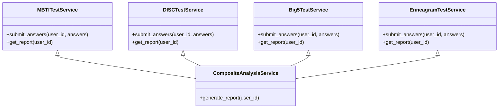
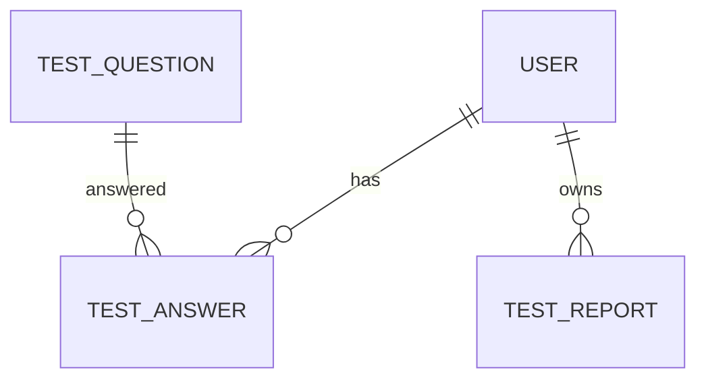
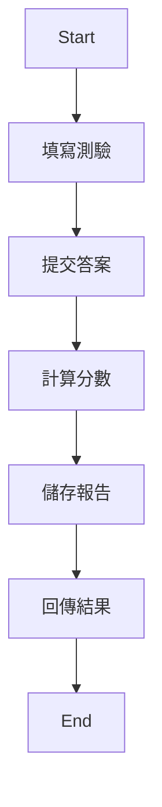
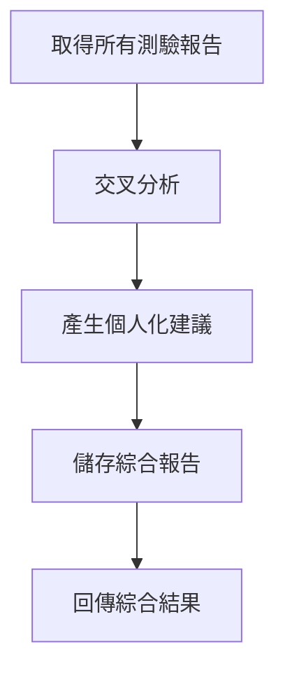
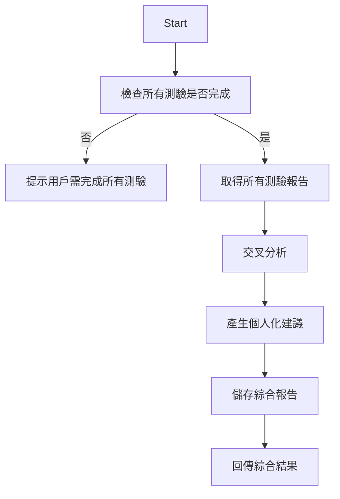

# 系統詳細設計文檔 (System Design Document) - 人格測驗與綜合分析模組

---

**文件版本 (Document Version):** `v0.1`

**最後更新 (Last Updated):** `2024-07-16`

**主要作者/設計師 (Lead Author/Designer):** `[請填寫]`

**審核者 (Reviewers):** `[請填寫]`

**狀態 (Status):** `草稿 (Draft)`

**相關系統架構文檔 (SA Document):** `[docs/02_system_architecture.md]`

**相關 User Stories/Features:** `US-001, US-002, US-003, US-004`

---

## 1. 引言 (Introduction)
### 1.1 目的 (Purpose)
* 本文件針對「人格測驗與綜合分析模組」提供具體的實現細節與規格，指導開發與測試。

### 1.2 範圍 (Scope)
* 涵蓋 MBTI、DISC、五大人格、九型人格四大測驗的題庫、作答、分析、報告產生，以及綜合分析與建議。

### 1.3 術語表 (Glossary)
| 術語 | 解釋 |
| :--- | :--- |
| MBTI | Myers-Briggs Type Indicator |
| DISC | Dominance, Influence, Steadiness, Conscientiousness |
| Big5 | 五大人格（開放性、嚴謹性、外向性、親和性、神經質） |
| Enneagram | 九型人格 |
| 綜合分析 | 將多種測驗結果進行交叉比對與建議產生 |

### 1.4 參考文件 (References)
* [系統架構文檔: docs/02_system_architecture.md]
* [PRD: docs/00_project_brief_prd_summary.md]

---

## 2. 模組/功能概述 (Module/Feature Overview)
### 2.1 功能描述 (Functional Description)
* 提供 MBTI、DISC、五大人格、九型人格四大測驗的題庫、作答、分數計算與結果解讀。
* 綜合分析模組：將多種測驗結果進行交叉分析，產生個人化報告與建議。
* 支援前端 API 查詢、提交作答、查詢歷史紀錄。

### 2.2 與系統其他部分的關係 (Relationship to Other System Parts)
* 輸入：前端送出作答資料、查詢請求
* 輸出：回傳分析報告、建議、分數
* 依賴：PostgreSQL（題庫、答案、報告）、FastAPI、SQLAlchemy、Pydantic

---

## 3. 詳細設計 (Detailed Design)
### 3.1 模組結構與組件設計
#### 3.1.1 類別圖/組件圖

* 各測驗服務負責單一測驗的作答與報告，綜合分析服務聚合各測驗結果產生個人化建議。

#### 3.1.2 主要類別/介面/函式詳述
* `MBTITestService/…TestService`：負責該測驗的作答儲存、分數計算、報告產生。
* `CompositeAnalysisService`：聚合所有測驗結果，產生綜合建議。

### 3.2 API 設計
#### 3.2.2 外部 API (External/Public APIs)
* **提交測驗答案**
  - POST `/api/test/{type}/submit`
    - type: mbti/disc/big5/enneagram
    - 請求體：{ user_id, answers: [ {question_id, value} ] }
    - 回應：{ report_id, score, result }
* **查詢個人測驗報告**
  - GET `/api/test/{type}/report?user_id=xxx`
    - 回應：{ report_id, score, result, created_at }
* **查詢綜合分析報告**
  - GET `/api/composite/report?user_id=xxx`
    - 回應：{ report_id, summary, suggestions, created_at }

### 3.3 資料庫設計
#### 3.3.1 資料庫表結構/Schema
**表名: test_question**
| 欄位名稱 | 型別 | 約束 | 描述 |
| :--- | :--- | :--- | :--- |
| id | SERIAL | PK | 題目ID |
| type | VARCHAR(16) | NOT NULL | 測驗類型(mbti/disc/big5/enneagram) |
| content | TEXT | NOT NULL | 題目內容 |
| options | JSONB | | 選項內容 |

**表名: test_answer**
| id | SERIAL | PK | 答案ID |
| user_id | INTEGER | NOT NULL | 用戶ID |
| question_id | INTEGER | FK | 題目ID |
| value | VARCHAR(16) | NOT NULL | 作答內容 |
| created_at | TIMESTAMP | DEFAULT now() | |

**表名: test_report**
| id | SERIAL | PK | 報告ID |
| user_id | INTEGER | NOT NULL | 用戶ID |
| type | VARCHAR(16) | NOT NULL | 測驗類型/綜合分析 |
| score | JSONB | | 分數/結果 |
| result | TEXT | | 結果描述 |
| created_at | TIMESTAMP | DEFAULT now() | |

#### 3.3.3 ER 圖


### 3.4 核心演算法/邏輯流程
#### 3.4.1 主要業務流程圖

#### 3.4.2 綜合分析流程


### 3.5 錯誤處理與例外機制
* 參數驗證失敗回傳 400，資料庫錯誤回傳 500，找不到報告回傳 404。
* 所有異常皆記錄於日誌。

### 3.6 配置管理
* 使用 `.env` 管理資料庫連線、快取設定等。

---

## 4. 設計考量 (Design Considerations)
### 4.1 安全性
* 僅本地存取，密碼加密，嚴格驗證 API 請求參數。
### 4.2 性能
* 單用戶流暢，資料庫加索引，快取常用查詢。
### 4.3 可擴展性
* 模組化設計，未來可獨立拆分各測驗模組。
### 4.4 可靠性與容錯
* 異常捕獲、日誌記錄、資料庫定期備份。
### 4.5 可測試性
* 類別/函式單元測試，API 測試。
### 4.6 可維護性
* 清楚分層、註解、型別標註。
### 4.7 部署考量
* Poetry 虛擬環境，.env 配置。

---

## 5. 介面定義 (Interface Definitions)
* 主要 API 請求/回應 schema 以 Pydantic 定義。

---

## 6. 未來展望 (Future Considerations)
* 支援更多測驗、AI 動態分析、團隊分析、雲端部署。

---

## 7. 附錄 (Appendices)
### 技術依賴清單
- Python 3.11+
- FastAPI
- Poetry
- SQLAlchemy
- Pydantic
- Uvicorn
- PostgreSQL
- alembic
- psycopg2
- Redis (可選)
- aioredis (可選)
- pytest
- logging
- python-dotenv
- React
- TypeScript
- Ant Design
- axios
- echarts

---
**文件審核記錄 (Review History):**
| 日期 | 審核人 | 版本 | 變更摘要 |
| :--- | :--- | :--- | :--- |
| 2024-07-16 | Gemini | v0.1 | 初稿建立 | 

---
### [補充] 綜合分析產生邏輯
* 綜合分析報告的產生依賴於用戶已完成所有單項測驗（MBTI、DISC、五大人格、九型人格）。
* 若有任一測驗未完成，則無法產生完整的綜合分析報告，API 將回傳提示訊息。

#### 綜合分析產生流程圖（補充）


#### API 回應補充範例
若用戶未完成所有測驗，`GET /api/composite/report` 回應如下：
```json
{
  "data": null,
  "meta": {
    "status": "incomplete",
    "message": "請先完成所有測驗，才能產生綜合分析報告。"
  }
}
```
--- 